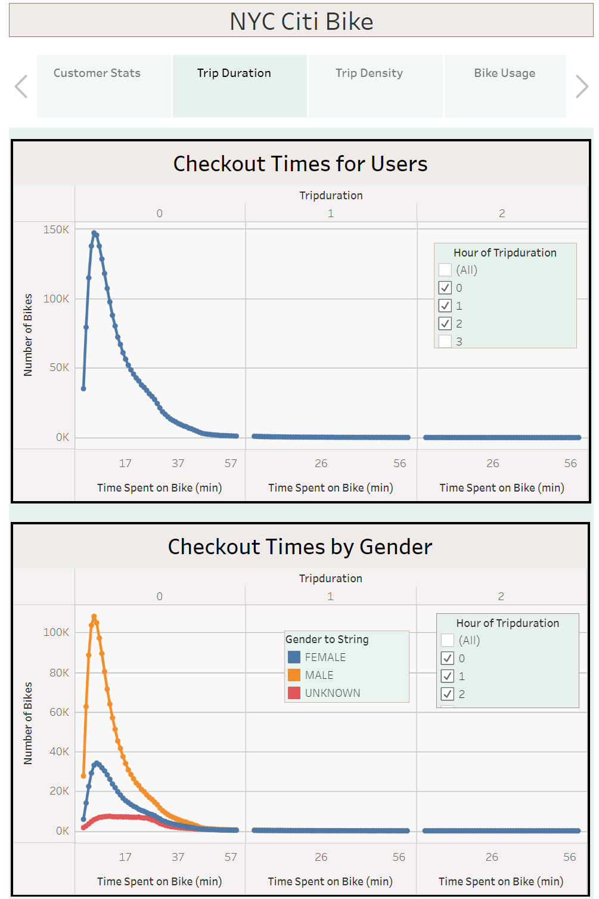

# Des Moines Bike Sharing Challenge

## NYC Citi Bike Analysis

### Overview of Analysis
Analysis done to convince investors that a bike-sharing program in Des Moines is a solid business proposal. To solidify the proposal, a bike trip analysis from NYC has been done with visualizations made using Tableau.

### Results

#### Customer Type
 
 
| Customer Story from Tableau  | Analysis |
| ------------- | ------------- |
|   | Content Cellhhhhhhhhhhhhhhhhhhhhhhhhhhhhhhhhhhhhhhhhhhhhhhhhh   idiuewiufhewiu   iewfjhieoiewhj  |

#### Trip Duration

#### Trip Density

#### Bike Usage 

